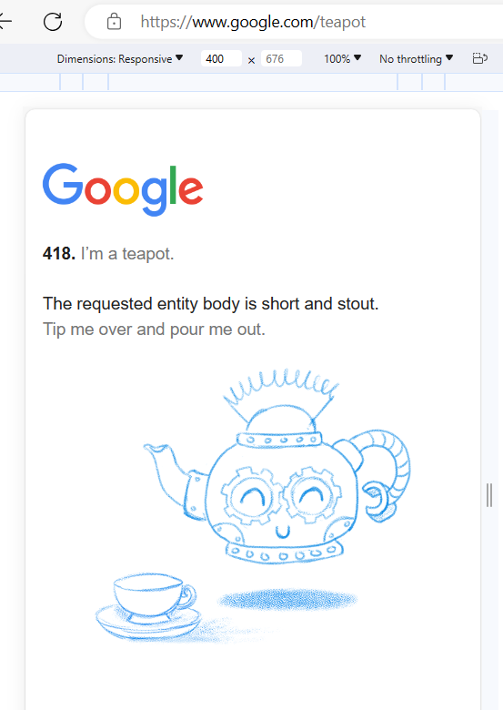
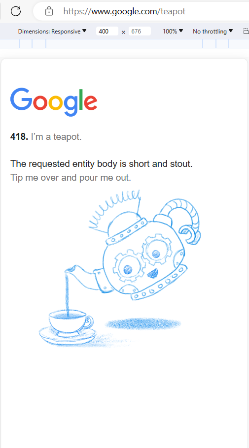

import IconLeftTiltPhone from './img/left-tilt-phone-icon.PNG'

Last week, while going through the [HTTP status codes](https://developer.mozilla.org/en-US/docs/Web/HTTP/Status) I found a teapot 😁.

The client error response code [418](https://developer.mozilla.org/en-US/docs/Web/HTTP/Status/418), seems to be introduced as an April fools joke 😁.

:::info 418 I'm a teapot
Any attempt to brew coffee with a teapot should result in the error
code "418 I'm a teapot". The resulting entity body MAY be short and
stout.
:::

If you're looking for a quick cup of tea, head here to [Google servers will serve you a cup of tea](https://www.google.com/teapot) 😁.

click the teapot on desktop or tilt your phone to the left  to serve tea!

😁