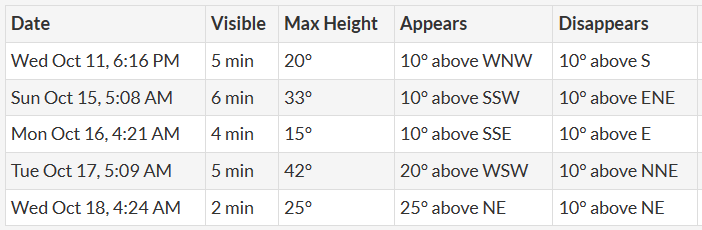

I was sitting out at my balcony on a clear evening sky, just gazing at the sky looking at the bright starts. I noticed a moving bright ligth in the sky and disappeared at the end of the horizon, was it a moving star, it got me curious.

It turned out to be the ISS [International Space Station](https://www.nasa.gov/reference/international-space-station/), the station is visible as it orbits the earth at an average altitude of 400km, Its almost the size of a football field [link](https://www.nasa.gov/image-article/comparison-of-size-of-international-space-station/)

*International Space Station*

The good part is that you don't need to keep looking at the sky in randomness to spot the station that could take forever 😃. The website - Spot the station  [https://spotthestation.nasa.gov/](https://spotthestation.nasa.gov/) allows you to [signup](https://spotthestation.nasa.gov/signup.cfm) for notification about the time and date of fly by. The website also has [live map](https://spotthestation.nasa.gov/tracking_map.cfm) of the station

The notification will have details of duration of visibilty and direction of the station's appearance and disappearance as shown below. use a compass (mobile app should be good enough) to know the direction.

*Station Spotting Details*

Next time you look at a bright light beaming through the sky, it's most likely the International Space Station ❤️
